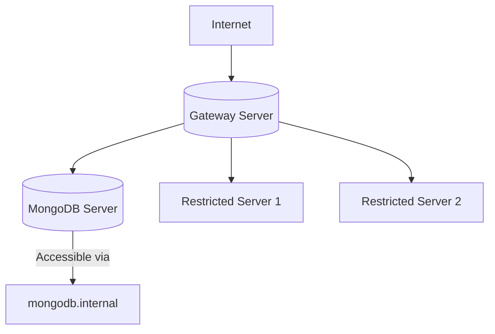

# **MongoDB Cluster Deployment with Ansible**

  

Automated deployment of MongoDB across hybrid Linux environments with intelligent gateway routing and access control.

## **Features**

- 🔒 **Secure deployment** - Firewall-restricted MongoDB access
- 🖥️ **Multi-OS support** - RHEL (Alt Linux, RedOS) and Debian (Astra Linux)
- 📡 **DNS integration** - Service discovery via `/etc/hosts`
- ⚡ **Idempotent operations** - Safe for repeated execution

## **Architecture**



## **Quick Start**

```bash
# Clone repository
git clone https://github.com/Andrrew20/mongo_with_ansible.git
cd mongodb-ansible

# Install dependencies
pip install ansible

# Deploy infrastructure
ansible-playbook -i inventory.ini playbooks/run_all.yml -v
```

### **Variables (`vars/main.yml`)**

```yaml
mongodb:
  version: "7.0"
  port: 27017
  dns_name: "mongodb.internal" #mongodb-servername

network:
  external_iface: "eth0" # your interface
  allowed_access_ip: "10.10.10.10" # MongoDB server IP
```

## **Workflow**

1. **Load Analysis** - Identifies most loaded server for gateway
2. **Gateway Setup** - Configures NAT and IP forwarding
3. **MongoDB Deployment** - Installs and configures database
4. **Firewall Rules** - Restricts access to MongoDB
5. **DNS Update** - Adds `mongodb.internal` to all hosts

## **Security**

- 🔐 MongoDB authentication enabled by default
- 🛡️ IP-based access restrictions
- 🔄 Automatic iptables persistence

## **Troubleshooting**

```bash
# Check MongoDB status
ansible mongodb_servers -i inventory.ini -m shell -a "systemctl status mongod"

# Verify connectivity
ansible all -i inventory.ini -m shell -a "ping -c 1 mongodb.internal"
```
