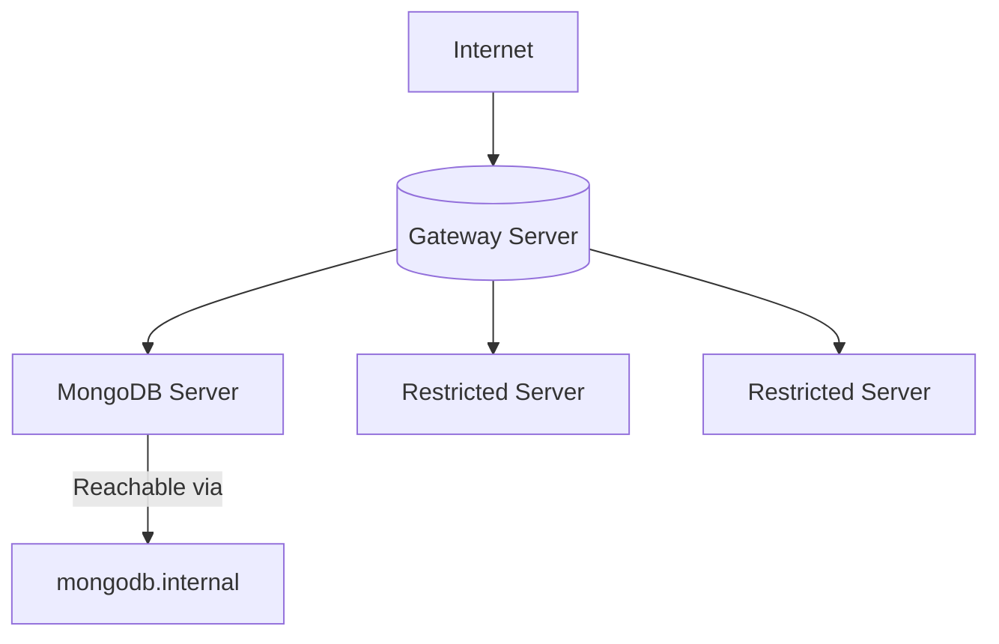

# **MongoDB Cluster Deployment with Ansible**


Automated deployment of MongoDB across hybrid Linux environments with intelligent gateway routing and access control.

## Table of Contents

- [Features](#-features)
- [Architecture](#-architecture)
- [Prerequisites](#-prerequisites)
- [Quick Start](#-quick-start)
- [Configuration](#-configuration)
- [Playbook Details](#-playbook-details)
- [Security](#-security)
- [Monitoring](#-monitoring)
- [Troubleshooting](#-troubleshooting)
- [Roadmap](#-roadmap)
- [Contributing](#-contributing)
- [License](#-license)

## 🌟 Features

- **Automatic Load Analysis** - Dynamically identifies most/least loaded nodes
- **Smart Gateway Routing** - Configures NAT and IP forwarding automatically
- **Secure MongoDB Deployment** - Isolated access with firewall rules
- **DNS Integration** - Service discovery via `/etc/hosts`
- **Multi-OS Support**:
  - ✅ Alt Linux (RHEL-based)
  - ✅ Astra Linux (Debian-based)
  - ✅ RedOS (RHEL-based)

## 🏗 Architecture



## 📋 Prerequisites

- Ansible 2.10+
- Python 3.8+
- SSH access to all servers
- Sudo privileges on target machines

## 🚀 Quick Start

```bash
# Clone repository
git clone https://github.com/yourrepo/mongodb-ansible.git
cd mongodb-ansible

# Install dependencies
pip install ansible

# Deploy infrastructure
ansible-playbook -i inventory.ini playbooks/run_all.yml
```

## ⚙ Configuration

### Inventory File (`inventory.ini`)

```ini
[linux_servers]
server1 ansible_host=192.168.1.10 ansible_user=admin os_type=alt
server2 ansible_host=192.168.1.11 ansible_user=admin os_type=astra
server3 ansible_host=192.168.1.12 ansible_user=admin os_type=redos

[mongodb_servers]
server3

[gateway_servers]
# Auto-populated during execution
```

### Variables (`vars/main.yml`)

```yaml
mongodb:
  version: "7.0"
  port: 27017
  bind_ip: "0.0.0.0"
  dns_name: "mongodb.internal"

network:
  external_iface: "eth0"
  internal_iface: "eth1"
```

## 📜 Playbook Details

| Playbook                   | Description            | Tags       |
| -------------------------- | ---------------------- | ---------- |
| `1_find_most_loaded.yml`   | Analyzes CPU/RAM usage | `analysis` |
| `2_setup_gateway.yml`      | Configures NAT/routing | `gateway`  |
| `3_deploy_mongodb.yml`     | Installs MongoDB       | `mongodb`  |
| `4_configure_firewall.yml` | Sets up access control | `firewall` |
| `5_update_dns.yml`         | Updates hosts file     | `dns`      |

Run specific components:

```bash
ansible-playbook -i inventory.ini playbooks/3_deploy_mongodb.yml --tags "mongodb"
```

## 🔒 Security

### Best Practices Implemented

- Firewall restrictions to MongoDB port
- Service binding to internal network
- Encrypted SSH connections

### Recommended Enhancements

```bash
# Enable MongoDB authentication
mongo --eval 'db.createUser({
  user: "admin",
  pwd: "strongpassword",
  roles: ["root"]
})'
```

## 📊 Monitoring

Basic health check playbook included:

```bash
ansible-playbook -i inventory.ini playbooks/check_health.yml
```

Sample output:

```
ok: [server1] => {
    "msg": "MongoDB available: 5ms latency"
}
```

## 🐛 Troubleshooting

| Error                    | Solution                             |
| ------------------------ | ------------------------------------ |
| "Could not resolve host" | Verify `/etc/hosts` entries          |
| Connection refused       | Check firewall rules on MongoDB host |
| Package install fails    | Verify OS compatibility in inventory |

View detailed logs:

```bash
ANSIBLE_DEBUG=1 ansible-playbook -i inventory.ini playbooks/run_all.yml
```

## 🗺 Roadmap

- [ ] Add TLS encryption
- [ ] Implement replica sets
- [ ] Integrate with Prometheus monitoring
- [ ] Add Terraform provisioning

## 🤝 Contributing

1. Fork the repository
2. Create your feature branch (`git checkout -b feature/fooBar`)
3. Commit your changes (`git commit -am 'Add some fooBar'`)
4. Push to the branch (`git push origin feature/fooBar`)
5. Create a new Pull Request

## 📄 License

This project is licensed under the MIT License - see the [LICENSE](LICENSE) file for details.
